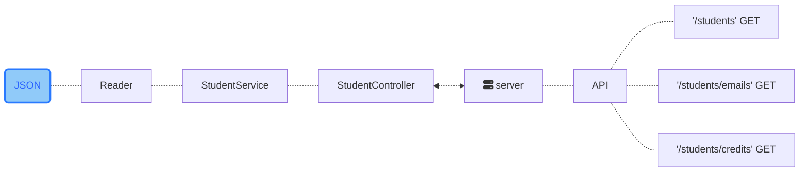

<h1 align="center">CODE CHALLENGE</h1>
<h3 align="center">Mission Backend JS By <a href="https://www.instagram.com/carlogilmar_/">MC @carlogilmar_</a></h3> 
<h4 align="center">Práctica 3 | Semana 4</h4>


Desarollo de una API que permita consultar datos sobre los estudiantes de Visual Partner-Ship.

Requerimientos:

- Habilitar un endpoint para consultar todos los estudiantes con todos sus campos.
- Habilitar un endpoint para consultar los emails de todos los estudiantes que tengan certificación haveCertification.
- Habilitar un endpoint para consultar todos los estudiantes que tengan credits mayor a 500.


#### Caracteristicas
Este proyecto fue contruido pensando  en la separación de responsabilidades, TDD y Style Guide para crear un código consistente y escalable.

- Node JS + Express
- TDD: Jest + supertest
- ESLint + StandardJS
- ES6 Imports
- Git
#### Dependecias

```json
"devDependencies": {
    "@babel/preset-env": "^7.17.10",
    "babel-jest": "^28.0.3",
    "eslint": "^8.14.0",
    "eslint-config-standard": "^17.0.0",
    "eslint-plugin-import": "^2.26.0",
    "eslint-plugin-n": "^15.2.0",
    "eslint-plugin-promise": "^6.0.0",
    "jest": "^28.0.3",
    "supertest": "^6.2.3"
  }
```
Como el nombre indica, estas son todas las dependencias de las cuales depende este proyecto para ejecutarse de forma correcta en local.

##### Babel 
    "@babel/preset-env": "^7.17.10",
    "babel-jest": "^28.0.3",
  
Estas dependencias de desarrollo permiten usar características de ES6 dentro de los archivos de pruebas unitarias con Jest.

##### ESLint

    "eslint": "^8.14.0",
    "eslint-config-standard": "^17.0.0",
    "eslint-plugin-import": "^2.26.0",
    "eslint-plugin-n": "^15.2.0",
    "eslint-plugin-promise": "^6.0.0",

ESLint te indica rápidamente errores de sintaxis de forma clara y así mismo nos ofrece un flag para corregir dichas inconsistencias  automática o manualmente, si no, logra solucionarlas por su cuenta.

Permite trabajar con un código más limpio y consistente, usando una guía de estilo.

##### Jest

    "jest": "^28.0.3",
    "supertest": "^6.2.3"

Jest y supertest son dependencias que no permitirán crear pruebas unitarias.
- jest: permitirá generar pruebas para la lógica de negocio.
- supertest: permitirá hacer pruebas a las rutas de la  API.

#### Diseño de los componentes

*⚠️ Doc en construcción...*
#### API
Esta es una API consumption-only, es decir, que solo podrás usarla para consultar datos a través del método **GET**. Esta API te permite consultar la sig. Información de todos los estudiantes de Visual Partner-Ship.


Puedes consultar:
- Una lista de Estudiantes.
- Una lista de Emails de estudiantes con certificación.
- Una lista de los estudiantes con créditos mayores que 500.

Ojo👀: Todo los devuelto por esta API siempre seran en formato **JSON**.

##### API ENDPOINTS

**`GET`** localhost:3000/**students**

No necesitas pasarle ningún otro parámetro. Este endpoint devolverá una lista de objetos con toda la información de cada unos de los estudiantes de Visual Partner-Ship.

```json
[
  {
    "id": "6264d5d89f1df827eb84bb23",
    "name": "Warren",
    "email": "Todd@visualpartnership.xyz",
    "credits": 508,
    "enrollments": [
      "Visual Thinking Intermedio",
      "Visual Thinking Avanzado"
    ],
    "previousCourses": 1,
    "haveCertification": true
  },
  {
    "id": "6264d5d85cf81c496446b67f",
    "name": "Lucinda",
    "email": "Sexton@visualpartnership.xyz",
    "credits": 677,
    "enrollments": [
      "Visual Thinking Avanzado"
    ],
    "previousCourses": 6,
    "haveCertification": true
  },...
```

**`GET`** localhost:3000/students/**emails**

No necesitas pasarle ningún otro parámetro. Este endpoint devolverá una lista de strings con los **emails** de aquellos estudiantes  de Visual Partner-Ship que tengan **certificación**.
```json
[
  "Todd@visualpartnership.xyz",
  "Sexton@visualpartnership.xyz",
  "Sharlene@visualpartnership.xyz",
  ...
  "Shields@visualpartnership.xyz",
  "Jewell@visualpartnership.xyz",
  "Hays@visualpartnership.xyz"
]
```

**`GET`** localhost:3000/students/**credits**

No necesitas pasarle ningún otro parámetro. Este endpoint devolverá una lista de objetos de aquellos **estudiantes** de Visual Partner-Ship que tengan **créditos mayores a 500**.

```json
[
    {
        "id": "6264d5d89f1df827eb84bb23",
        "name": "Warren",
        "email": "Todd@visualpartnership.xyz",
        "credits": 508,
        "enrollments": [
            "Visual Thinking Intermedio",
            "Visual Thinking Avanzado"
        ],
        "previousCourses": 1,
        "haveCertification": true
    },
    {
        "id": "6264d5d85cf81c496446b67f",
        "name": "Lucinda",
        "email": "Sexton@visualpartnership.xyz",
        "credits": 677,
        "enrollments": [
            "Visual Thinking Avanzado"
        ],
        "previousCourses": 6,
        "haveCertification": true
    },...
```
#### Estructura

- **📂libs**: contiene la estructura de archivos  con las que se construye toda la funcionalidad de la API.
  - 📂services: contiene toda la lógica de la aplicación.
  - 📂controllers: usa los métodos dentro de services para transformar la data devuelta por el Reader.js.
  - 📂utils: contiene la utilidad que permitirá obtener toda la data de un archivo json, ser parciarda y devolverla lista para ser utilizada por el controller. 
    - 📄Reader.js
  - 📄server.js
- **📂test**: contiene las pruebas necesarias para asegurar que el código funciona como se espera.
  - 📂serivces: añade pruebas a cada module dentro de esta carpeta. 
  - 📂utitls: añade pruebas a cada utilidad dentro de esta carpeta. 
  - 📄server.test.js: añade pruebas con supertest para asegurar que lo que devuelve cada petición es lo que se espera.
